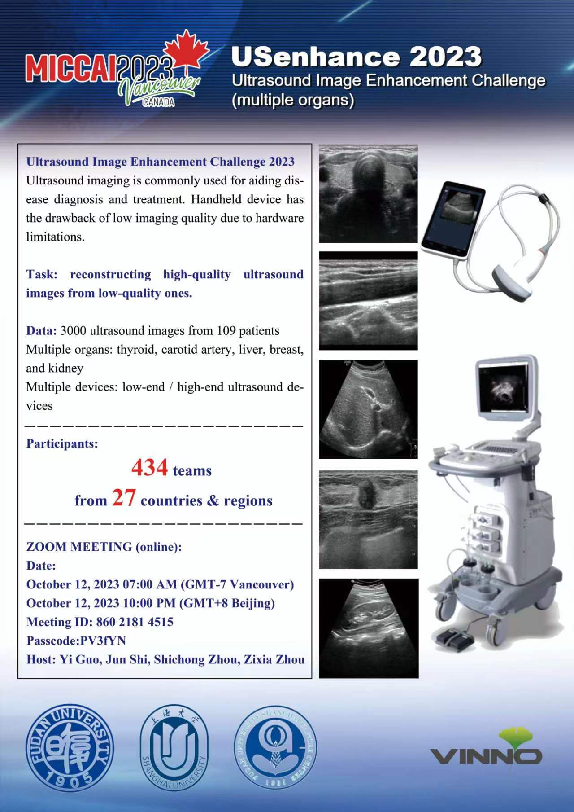

# USenhance2023

Ultrasound (US) imaging is a ubiquitous diagnostic tool in modern medicine, offering safety and affordability compared to other imaging modalities. However, the increasing use of handheld US devices has raised concerns about image quality, as it often falls short of that produced by larger hospital machines. To address this challenge, we present a novel approach leveraging a modified CycleGAN model with an added gamma transition.
<center>

</center>



# Prerequisites

\- Win10

\- Python 3

\- CPU or NVIDIA GPU + CUDA CuDNN

# Environment (Using conda)

```
conda install numpy pyyaml mkl mkl-include setuptools cmake cffi typing opencv-python

conda install pytorch torchvision -c pytorch # add cuda90 if CUDA 9

conda install visdom dominate -c conda-forge # install visdom and dominate
```

# Visualization when training

python -m visdom.server

# To open this link in the browser

http://localhost:8097/


# Command to run

Please note that root directory is the project root directory.

## Train

```
python train.py
--dataroot
datasets/ultrasound
--name
cyclegan_ultrasound_2000
--model
cycle_gan
--input_nc
1
--output_nc
1
--direction
AtoB
--dataset_mode
Ultrasound
--norm
instance
--batch_size
4
--lr_policy
linear
--gpu_ids
5
--display_port
9006
--n_epochs
1500
--n_epochs_decay
500

```


